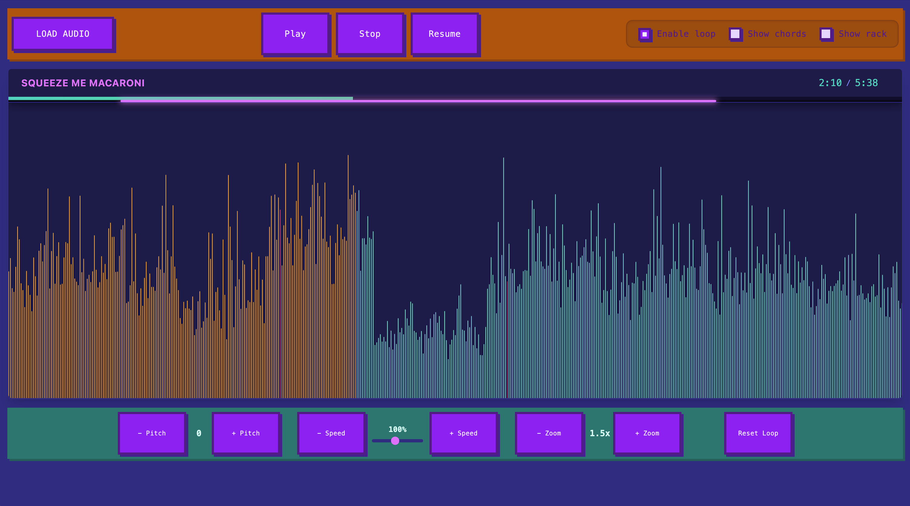
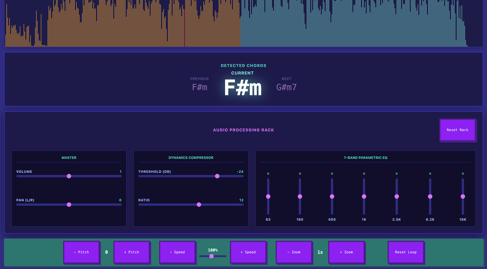

# Audio Looper Visualizer

A web-based audio player and waveform visualizer built with React, Vite, and the Web Audio API. 

## Features

- **Waveform Visualization:** Render an accurate visual representation of the audio peak data using a responsive canvas integration. 
- **Dynamic Looping:** Interactively set your start and end looping markers by clicking and dragging directly on the visual waveform! The selected portions will seamlessly trigger internal looper limits when you enable the loop setting.
- **Playback Controls:** Fully functional Play, Stop, and Resume tools that automatically synchronize out-of-the-box with your visual playhead marker.
- **Real-time Tuning:** Uptune or Downtune the pitch and playback rate of your audio dynamically on the fly.

## Why this project exists

This project is created to more easily learn new songs by ear, practice playing along with them, and generally get a better understanding of the structure of songs. It's a clone of the "Transcribe!" windows app, but since I don't use windows, I decided to create my own version of it.

## Screenshots

## Running the application

1. Run `npm install` to install all necessary dependencies.
2. Run `npm run dev` to start the local development server.
3. Open your browser and navigate to the provided localhost URL (e.g., `http://localhost:5173`).
4. Upload an audio file using the provided interface and start looping!

## Built With

*   [React](https://react.dev/)
*   [Vite](https://vitejs.dev/)
*   [Tailwind CSS](https://tailwindcss.com/)
*   [Web Audio API](https://developer.mozilla.org/en-US/docs/Web/API/Web_Audio_API)
